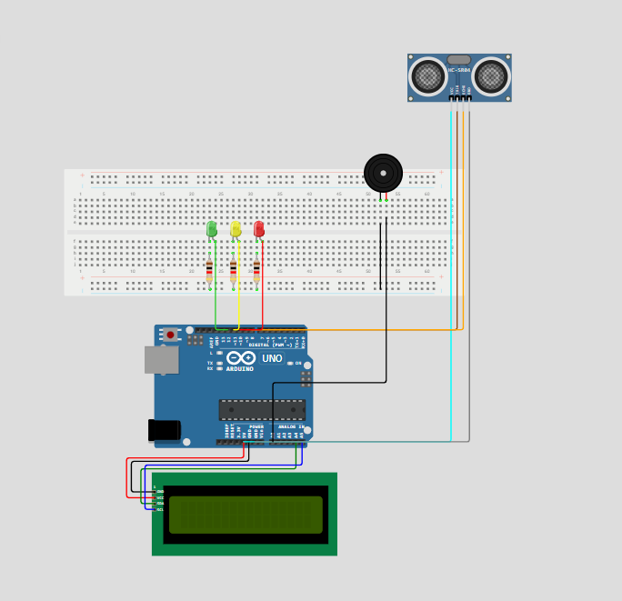

### Descrição do problema

As enchentes são tragédias anunciadas. Quando a água invade ruas, casas e vidas, ela expõe não apenas a força implacável da natureza, mas também, as falhas humanas: o desmatamento, a impermeabilização do solo, falta de planejamento urbano e por último e um dos mais importantes o lixo descartado incorretamente. Cada enchente não destrói apenas estruturas, mas sonhos, memórias e futuros. É preciso entender que enquanto nós como sociedade continuarmos ignorando problemas como esse, acidentes como esse que muitas vezes acabando sendo fatais vão continuar acontecendo, e como sempre, quem mais sofre com esses acontecimentos são os mais vulneráveis.

### Nossa solução

Visto que esta problemática ainda permanece com extrema frequência, eu e minha equipe desenvolvemos um sistema inovador que realiza a medição em tempo real do nível de água de rios e bueiros. Esses dados são atualizados automaticamente em uma plataforma web acessível a toda a população, permitindo que civis possam consultar, especialmente em dias chuvosos ou de risco, a situação hídrica em pontos próximos de sua região(situação dos rios e bueiros).

Além disso, todas as informações coletadas são enviadas diretamente para os órgãos públicos municipais e estaduais, oferecendo suporte técnico para que possam tomar as medidas necessárias, como a limpeza preventiva de bueiros ou a formulação de novas estratégias para melhorar o escoamento dos rios.

Nosso objetivo é unir tecnologia, cidadania e gestão pública para minimizar os impactos das enchentes e proteger vidas.

### Integrantes
Alexandre Lucas  RM: 561732
Vitor Carvalho   RM: 562298
Murilo Pina      RM: 563397

### Simulação no Wokwi

Você pode acessar a simulação do projeto através do seguinte link:  
[👉 Acesse aqui a simulação no Wokwi](https://wokwi.com/projects/432203265631815681)

### Descrição instrucional

Basicamente o nosso projeto consiste em um sensor ultrassônico que mede a distância da água que está no bueiro até a tampa dele, no caso do rio, mede a distância da água do rio até o ponto  definido. Com base nos dados coletados, Ele exibe uma mensagem no LCD L2C, dizendo se está com risco de enchente, se o nível do bueiro/rio está médio ou se ele está seguro. Dependo das informações ele acendo o led verde, amarelo ou vermelho, juntamente a isso também pode vir o disparo da buzina ou um leve "BIP".

### Vídeo da simulação

<video controls src="videoGSedge.mp4" title="Title"></video>

### CIRCUITO

